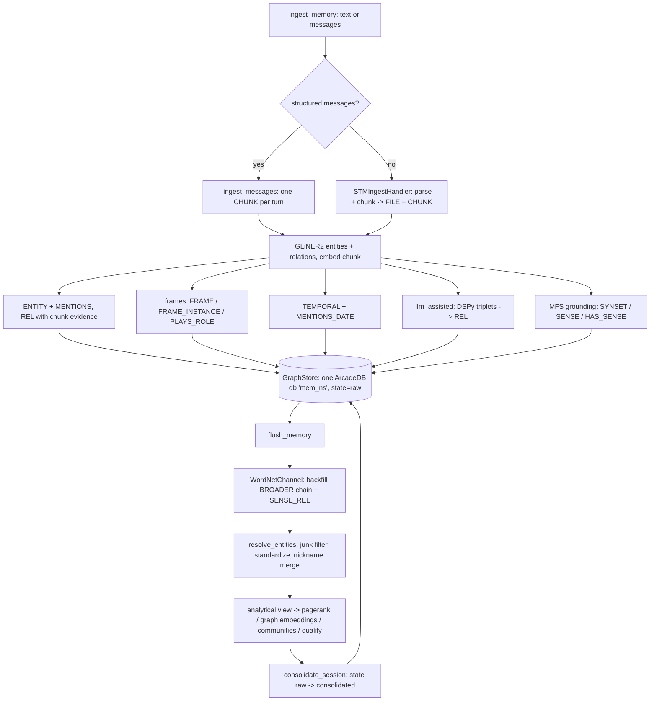
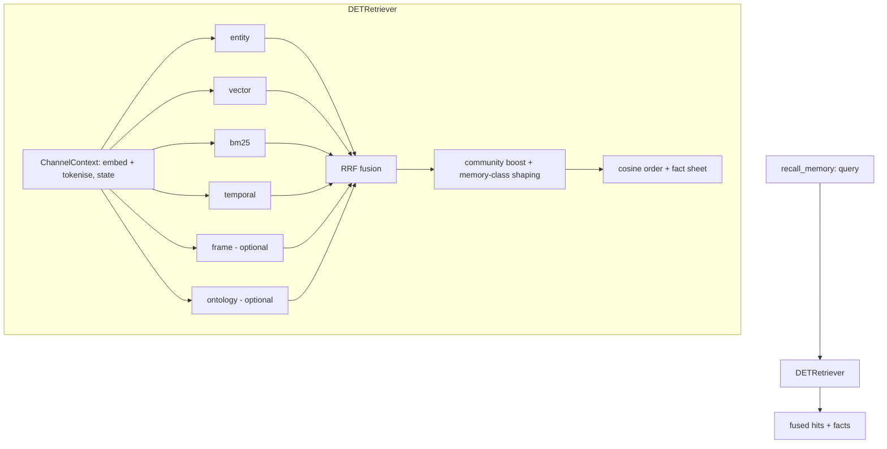

# Architecture

processrecall is an agentic memory system. It ingests conversations and documents,
builds a knowledge graph over [ArcadeDB](https://arcadedb.com), and serves hybrid
retrieval to an agent. This document traces the moving parts and where each lives.

## Public entry point

Everything is reached through `Memory` (`processrecall/memory.py`), a
transport-neutral, async facade. It is wrapped by the MCP stdio server
(`processrecall/server/mcp/`), but the class is usable directly:

```python
from processrecall import Memory

async with Memory() as mem:
    await mem.ingest_memory(messages, session_id="s1")
    await mem.flush_memory("s1")
    hits = await mem.recall_memory("who did Caroline meet?", session_id="s1")
```

Async methods on the facade:

| Method | Purpose |
| --- | --- |
| `ingest_memory` | Ingest text or a message list into the graph (lifecycle state `raw`). |
| `recall_memory` | Ranked hybrid recall; returns fused hits plus a fact sheet. |
| `flush_memory` | Consolidate one session in place: entity resolution, analytics, `raw` → `consolidated`. |
| `purge_memory` | Delete the namespace's data (all, or one session). |
| `drop_namespace` | Drop the whole namespace database (refused for the default namespace). |
| `stats` | Node counts for the namespace, chunks split by lifecycle state, plus the `SOURCE` rows recording which (channel, version) resources this namespace holds. |
| `doctor` | Backend connectivity check for the namespace database. |
| `rebind_memory` | Re-ground a channel's stored mentions against the currently loaded resource: new groundings under the current version, old ones flagged `superseded` rather than deleted. |
| `corpus_ingest` | Batch-ingest documents into one session, then consolidate it. |
| `ltm_entity` / `ltm_entities` | Read-only graph browsing helpers. |

A namespace-first SDK surface (`add`, `search`, `flush`) wraps the same verbs with
mem0-style `user_id` / `agent_id` / `run_id` scoping (`Memory._scoped_session_id`).

## Configuration and modes

Config is `GraphKnowsSettings` (`processrecall/settings.py`), a `pydantic-settings`
model. Every field maps to a `GRAPHKNOWS_`-prefixed environment variable (also
read from a `.env` file). Key ones: `GRAPHKNOWS_MODE`, `GRAPHKNOWS_NAMESPACE`,
`GRAPHKNOWS_ARCADEDB_URL`, `GRAPHKNOWS_LLM_MODEL`, `GRAPHKNOWS_LLM_API_KEY`,
`GRAPHKNOWS_EMBED_MODEL`, `GRAPHKNOWS_EMBED_API_BASE`, `GRAPHKNOWS_ONTOLOGY_FILE`,
`GRAPHKNOWS_ENABLE_FRAMES`, `GRAPHKNOWS_ENABLE_FE_TYPE_GATE`, `GRAPHKNOWS_FACT_CONTEXT`.

`GRAPHKNOWS_MODE` (enum `MemoryMode`) governs extraction. There is no separate
profile object: the mode fork lives in exactly one factory, `build_decoder`
(`processrecall/ingestion/extraction/entities/__init__.py`), on the write path.
Retrieval does not fork — `build_retriever`
(`processrecall/retrieval/__init__.py`) always returns `DETRetriever`.

| Mode | Extra extraction | Retrieval | API keys |
| --- | --- | --- | --- |
| `llm_free` (default) | GLiNER2 entities + its precision-gated relations; no LLM extractor | `DETRetriever` (deterministic, channel fan-out + RRF) | none |
| `llm_assisted` | additionally DSPy ontology-guided relation extraction | same `DETRetriever` | LLM + optional embed |

Embeddings default to a local `sentence-transformers` model, so `llm_free` runs
with zero API keys.

## Memory model: one golden-layer database

There is **one physical ArcadeDB database per namespace** — `mem` for the default
namespace, `mem_<ns>` otherwise (`processrecall/storage/namespace.py`, `db_name`).
The old three-store split (separate `stm` / `ltm` databases plus a vector store)
is gone: `GraphStore` (`processrecall/storage/arcadedb/graph_store.py`) absorbs all
of it, including embeddings, which live directly on `CHUNK` / `ENTITY` / `TOPIC` /
`FRAME` vertices behind `LSM_VECTOR` indexes.

Short-term versus long-term is a **lifecycle property, not a database**. A `state`
in `{raw, consolidated}` sits on `SESSION` / `CHUNK` / `ENTITY` and on relation
edges; every write lands `raw`, and flush flips a session to `consolidated` in
place. Retrieval scope maps onto that filter (`_scope_to_state` in
`processrecall/retrieval/retriever.py`): `stm` → `raw`, `ltm` → `consolidated`,
`both` → no filter.

### Schema

The DDL is a pure ordered statement list, `_CORE_DDL`
(`processrecall/storage/arcadedb/_schema.py`), applied idempotently by
`GraphStore.ensure_schema(dims)` — `dims` is substituted into the vector indexes so
they match the configured embedder.

- Vertices: `SESSION`, `TURN`, `FILE`, `CHUNK`, `ENTITY` (keyed on `name_norm`),
  `TEMPORAL` (one node per ISO date), `TOPIC`, `FRAME` (canonical — one vertex
  per frame type for the whole namespace, keyed by the frame name),
  `FRAME_INSTANCE`, `FE` (one vertex per FrameNet `(frame, frame element)`
  pair, carrying its coreness — Core, Peripheral, Extra-Thematic or
  Core-Unexpressed — plus its CoreSet index and Requires/Excludes targets),
  `SEMTYPE` (FrameNet semantic types), `ONTOLOGY`, `ONTOLOGY_CLASS`, `SOURCE`
  (one vertex per `(channel, version)` resource import — ontology, FrameNet or
  WordNet — with its source hash and import counts; see
  [ontology.md](ontology.md#schema)), `SYNSET` (a WordNet concept, `id`
  `wn30:`-prefixed and built from the synset's offset+pos, which survives a
  release upgrade — its `name`, e.g. `dog.n.01`, is carried separately for
  readability only) and `SENSE` (a WordNet word sense, `id` built from its
  sense key, the bridge that stays stable across a WordNet release upgrade
  where synset offsets do not). Both are minted lazily — one SYNSET/SENSE
  pair per grounding, not the whole ~117k-synset corpus up front.
- Edges: `IN_SESSION` (FILE→SESSION), `PART_OF` (CHUNK→FILE), `MENTIONS`
  (CHUNK→ENTITY), `MENTIONS_DATE` (CHUNK→TEMPORAL),
  `IN_TOPIC` (ENTITY→TOPIC, with a
  `pagerank` property — the cluster membership itself, and the only persisted
  topic edge), `EVOKED_BY`
  (FRAME→CHUNK, with the per-chunk `confidence` — a canonical FRAME carries no
  chunk or session of its own, so everything per-evocation lives here),
  `BROADER` (the subsumption taxonomy, FRAME→FRAME, ONTOLOGY_CLASS→ONTOLOGY_CLASS
  and SYNSET→SYNSET hypernymy, discriminated by a `rel` property; a WordNet
  `instance_hypernym` edge — an individual's link to its class, e.g. Mount
  Everest → mountain — carries `transitive = false` so a closure query never
  chains past it, unlike an ordinary `hypernym` edge), `FRAME_EVOKED_IN`
  (FRAME_INSTANCE→CHUNK), `PLAYS_ROLE` (FRAME_INSTANCE→ENTITY, with a `role`
  property), `HAS_FE` (FRAME→FE), `HAS_SEMTYPE` (FE→SEMTYPE), `REQUIRES_FE`
  and `EXCLUDES_FE` (FE→FE, FrameNet's own role-configuration constraints),
  `EVOKES` (FRAME_INSTANCE→FRAME, the fact plane's link into the frame
  taxonomy, since `BROADER` hangs off the canonical FRAME vertex), `IN_SYNSET`
  (SENSE→SYNSET), `SENSE_REL` (SENSE→SENSE, WordNet's lexical relations —
  antonym, derivationally_related_form, pertainym, participle — which hold
  only between senses and never between synsets), `HAS_SENSE` (ENTITY→SENSE,
  the WordNet grounding itself: token-level, keyed on `chunk_id` + `span` +
  `synset` so the same entity can hold different senses in different
  chunks instead of one grounding overwriting another), and `REL`.
- `REL` carries **every** ENTITY→ENTITY fact; the predicate is the `predicate`
  property, not the edge type name. The vocabulary is open and mostly single-use,
  so a type-per-predicate minted hundreds of near-empty types plus a DDL
  round-trip on the ingest hot path. `predicate` itself mixes two vocabularies:
  a relex/DSPy relation label is written bare, a frame-derived co-role edge is
  prefixed `fn:` (e.g. `fn:Giving`) so the two are distinguishable without a
  second lookup; frame facts otherwise reach the fact sheet through the
  `FRAME_INSTANCE`/`PLAYS_ROLE` layer, not through these edges.

No edge joins the FrameNet vertices (`FRAME`, `FE`, `SEMTYPE`) to the ontology
vertices (`ONTOLOGY`, `ONTOLOGY_CLASS`, `ONTOLOGY_PROPERTY`). The two are
independent signals with no direct edge between them: a frame evoked on a
chunk and an ontology class matched on the same chunk share nothing beyond
that chunk. The one indirect path is
`FRAME_INSTANCE-[:PLAYS_ROLE]->ENTITY-[:INSTANCE_OF]->ONTOLOGY_CLASS`, but
that types the *entity*, not the role — an entity is ontologically typed only
by its own `INSTANCE_OF` edge, never by the role it fills in a frame
instance.

Schema conventions are `type` not `label`, `confidence` not `score`, and
`valid_at` / `invalid_at` / `is_current` for bi-temporal relation edges.

**Bi-temporal supersedence.** For a known single-valued predicate
(`_SINGLE_VALUED_RELATIONS` — `WORKS_AT`, `LIVES_IN`, `MARRIED_TO`, …) a new fact
tombstones the existing current edge via `GraphStore._supersede_edge`: it sets
`invalid_at` and `is_current = false` rather than deleting, preserving history.

### Ingest

`ingest_memory` builds an `STMService` through `build_stm_service`
(`processrecall/ingestion/__init__.py`) and routes on input shape
(`processrecall/ingestion/stm/service.py`):

- A structured message list goes through `ingest_messages`, writing one `CHUNK`
  per message with `kind='turn'`.
- Plain text goes through `ingest` → `_STMIngestHandler`
  (`processrecall/ingestion/stm/ingest.py`): the text is parsed
  (`processrecall/ingestion/parsers/`) and chunked into `FILE` + `CHUNK` nodes.

Both paths converge on the same write helper, which per chunk:

1. embeds the text and writes it onto the `CHUNK` vertex;
2. runs `GLiNER2EntityExtractor`
   (`processrecall/ingestion/extraction/entities/extractor.py`) and writes `ENTITY`
   nodes plus `MENTIONS` edges — `is_graph_entity_name`
   (`processrecall/ingestion/extraction/entities/hygiene.py`) is the gate every
   minting path routes through, and rejects a span of three or more tokens
   whose syntactic root is a verb (e.g. "make the dance studio look awesome")
   as a predication rather than a name; the ingest result's `abstentions`
   reports the `entities` written and the `untyped_entities` share among them
   (a generic `ENTITY`/`EVENT` type with no relation domain/range to match);
3. grounds each entity to its WordNet most-frequent-sense (MFS baseline —
   supervised WSD and PPR re-ranking are stubbed until this plane proves it
   has a reader) via `_link_senses`, writing a `SYNSET` / `SENSE` pair and a
   token-level `HAS_SENSE` edge keyed on `chunk_id` + `span`; a WSD miss or
   unprovisioned corpus abstains rather than failing the chunk
   (`abstentions.senses_grounded` / `senses_ungrounded`). The synset's
   hypernym chain and cross-sense relations are not written here — that is a
   flush-time backfill, see `WordNetChannel` below;
4. writes the extractor's open-vocabulary relations as `REL` edges with
   chunk-level evidence provenance (no ontology filter — it would reject every
   open-vocab label);
5. in `llm_assisted`, additionally runs the injected DSPy relation extractor and
   writes its triplets as `REL` edges with `source='dspy'`;
6. when `enable_frames` is on, matches FrameNet frames by embedding
   (`processrecall/frames/index.py`) into `FRAME` / `EVOKED_BY`, and
   role-fills `FRAME_INSTANCE` / `PLAYS_ROLE` via
   `processrecall/ingestion/extraction/relations/frame_srl.py`. A chunk can evoke
   more than one frame: each clause's main verb(s), each nominalisation with
   argument structure ("the acquisition of X by Y"), and each light-verb
   construction ("made a decision") is its own trigger and can produce its own
   instance, so a nominalisation next to a verb in the same sentence is no
   longer masked by it. A light-verb trigger is read as a detector pointing at
   its noun object's frame rather than contributing the verb's own frames, and
   the resulting `FRAME_INSTANCE` carries `lvc = true`. Role filling is
   scoped to the trigger's sentence, not its whole chat turn, so two events on
   one turn don't share fillers; an instance is written only once at least two
   role fillers resolve to an `ENTITY`, and a same-chunk sibling with a strict
   subset of another's fillers collapses into it. A role configuration is then
   checked against FrameNet's own frame-element plane
   (`processrecall/symbolic/framenet/fe.py`, imported into the graph as `FE` /
   `SEMTYPE`, see Schema above): an instance whose filled roles violate a
   Requires or Excludes constraint is dropped
   (`abstentions.frame_invalid_requires` / `frame_invalid_excludes`), and one
   that fills two roles from the same FrameNet CoreSet while leaving another
   CoreSet empty is dropped as well (`frame_coreset_unsatisfied`) — a
   CoreSet's members are alternative expressions of one core participant, so a
   bare count of filled roles cannot see that gap. Every unfilled Core role is
   counted too, split into `unfilled_core_cni` (a passive clause licenses
   omitting it — Constructional Null Instantiation) versus
   `unfilled_core_unknown` (no such licence — a genuine miss). Setting
   `GRAPHKNOWS_ENABLE_FE_TYPE_GATE` (default off) adds a further veto: a role
   filler whose graph entity type conflicts with the frame element's
   FrameNet semantic type is dropped and counted under `frame_semtype_veto`;
   the comparison is a fixed equivalence table between the graph's own entity
   types and FrameNet semantic types, and consults no ontology class;
7. resolves dates (`resolve_temporal` in `processrecall/temporal.py`) into
   `TEMPORAL` nodes and `MENTIONS_DATE` edges.

`OntologyPredicateMapper` (`processrecall/ingestion/extraction/relations/filter.py`)
remains available for ontology-constrained predicate mapping, but the hot ingest
path does not filter GLiNER2 labels through it.

### Flush / consolidation

`Memory.flush_memory(session_id)` consolidates a session **in place** — there is
no promotion pipeline and nothing is copied between databases. Each step is
awaited through a local `step()` helper that records a named error instead of
aborting, so an analytics failure never skips the state flip:

1. **Channel populate** — every default channel's `populate(store, session_id)`
   runs first, soft-failing under its own name so one broken extension does
   not cost the rest of the flush. `WordNetChannel` (`processrecall/channels/wordnet.py`)
   is the one that does anything today: scoped to this session's chunks, it
   mints the shortest hypernym chain (`BROADER`) for any `SYNSET` this
   session grounded that is still missing one, and `SENSE_REL` edges among
   this session's grounded senses — the per-chunk write only mints the
   `SYNSET`/`SENSE` pair and the `HAS_SENSE` edge, so this backfill is what
   attaches a grounding to the wider taxonomy.
2. **Entity resolution** — `resolve_entities`
   (`processrecall/ingestion/consolidation/entity_resolution.py`), a layered
   most-confident-first resolver: junk/hub filter, name-standardization merge for
   non-person entities, then person-nickname merge. Embedding similarity is
   deliberately not the primary mechanism (a true nickname pair scores below two
   distinct co-occurring people).
3. **Analytical view** — `GraphStore._ensure_analytical_view` is rebuilt once and
   shared by the three algorithms below (`skip_view_ensure=True`), since rebuilding
   is not free.
4. **PageRank** — `compute_and_persist_pagerank`, native ArcadeDB `algo.*` with a
   numpy power-iteration fallback; persisted onto `ENTITY.pagerank`.
5. **Graph embeddings** — `compute_graph_embeddings` → `ENTITY.graph_embedding`.
6. **Communities** — `compute_communities` → `ENTITY.community_id`.
7. **Community quality** — `compute_community_quality`, writing modularity /
   conductance metrics onto `COMMUNITY` vertices.
8. **State flip** — `consolidate_session(session_id)` moves the session's chunks
   from `raw` to `consolidated`. Nothing is deleted; relation canonicalization is
   not part of this path.
9. **Entity coverage audit** — `GraphStore.entity_coverage()` counts, over the
   whole namespace, `ENTITY` nodes with no `REL` edge in either direction and no
   incoming `PLAYS_ROLE`; returned as `entity_coverage: {total, connected,
   isolated}` in the flush result, since isolation is a property of the
   finished graph and a later chunk's relation can connect an entity an
   earlier chunk minted.

`corpus_ingest` is a thin loop: `ingest_memory` per document into one session,
then a single `flush_memory`. Documents without text are recorded in `errors` and
skipped.

## Storage: ArcadeDB

ArcadeDB is reached through a thin async httpx client, `ArcadeDBClient`
(`processrecall/storage/arcadedb/client.py`), wrapping the REST API (query, command,
transactions) with HTTP Basic Auth. `processrecall/storage/__init__.py` holds the
namespace-aware factories — `build_arcadedb_client`, `build_graph_store` — which
return **unconnected** stores so the client binds to the caller's event loop when
`connect()` is awaited.

ArcadeDB constraints the store works around, documented in its module docstring:
Cypher has no DDL surface (schema is SQL); embedding values must be inline SQL
literals because LIST params conflict with the `LSM_VECTOR` index; openCypher has
no `IN $list`, so every interpolated string goes through
`processrecall/storage/arcadedb/_sql.py`.

## Embeddings

`processrecall/storage/embedder.py` provides `embed` / `embed_one` (LRU-cached),
and `embed_dim`. By default a local
`sentence-transformers` model (`BAAI/bge-small-en-v1.5`, 384-dim) runs in-process
on CPU — no API key. Setting `GRAPHKNOWS_EMBED_API_BASE` routes embeddings through
a remote OpenAI-compatible `/embeddings` endpoint instead (model and key from
`GRAPHKNOWS_EMBED_MODEL` / `GRAPHKNOWS_EMBED_API_KEY`). There are no silent
embedding fallbacks — errors propagate.

## Retrieval

`recall_memory` builds the retriever lazily (`Memory._get_retriever`, guarded by
an `asyncio.Lock`).

### Channels

A **channel** (`processrecall/channels/base.py`) is one memory signal exposing
`collect(ctx, rt, top_k)` — ranked query candidates as
`{chunk_id: (score, info)}`. `default_channels`
(`processrecall/channels/registry.py`) returns the live set; insertion order defines
fusion order.

The baseline signals (entity, vector, bm25, temporal) are collected directly by
the retriever spine, with frames and ontology added as optional channels. The old
STM/LTM channel split collapsed with the databases, so each queries the one
`GraphStore` under a lifecycle `state` filter instead of routing to a physical
store:

- `entity` — entity-graph traversal from query-token entity nodes
- `vector` — dense ANN over chunk embeddings (plus a declarative query variant)
- `bm25` — lexical search (`rank_bm25` when importable, tokenised fallback otherwise)
- `temporal` — date-anchored traversal (`processrecall/temporal.py`)

Only the optional signals are `Channel`s: `FrameChannel`
(`processrecall/channels/frames.py`, name `frame`) when `settings.enable_frames`,
and `OntologyChannel` (`processrecall/channels/ontology.py`, name `ontology`) when
`settings.enable_ontology_channel`. `WordNetChannel`
(`processrecall/channels/wordnet.py`, name `wordnet`) is also registered
unconditionally, but implements only `populate` (the flush-time hypernym/
sense-relation backfill described under Flush above) and not `collect` — it
contributes no leg to the RRF fusion below and does not affect retrieval.
A graph-traversal channel (`ppr`) and a
`topic` channel both existed and were removed — `ppr` returned the worst
gold-hit ratio of six channels, and nothing on the read path consumed what the
topic stage wrote. See the `registry.py` docstring for the measurements.

### DETRetriever (llm_free)

`DETRetriever` (`processrecall/retrieval/retriever.py`) is the channel-blind spine:
it builds a `ChannelContext` (query embedding + declarative variant, two token
sets), fans the channels out concurrently with `asyncio.gather`, then fuses and
ranks. A failure in any channel raises loudly rather than silently degrading
recall.

Candidates are fused by **RRF** (`processrecall/ranking/rrf.py`, `rrf_score`,
`RRF_K = 60`). The fused score is the final rank: the cross-encoder
reranker was removed after measurement (evidence_recall 0.636 → 0.692 without
it).

PageRank shaping and IDF discriminativeness were removed: the former read
`pagerank` from CHUNK metadata while the value lives on `ENTITY`, so the
multiplier was always 1.0, and nothing ever called the latter.

Separately from the ranked passages, `_fact_sheet` resolves the query's entities
(`GraphStore.resolve_query_entities`) and returns their typed relations and
frame-instance role fills (`GraphStore.entity_fact_context`) as a compact fact
sheet on `RetrievalContext.facts`. It soft-fails and is disabled by
`GRAPHKNOWS_FACT_CONTEXT=false`.

`DETRetriever` is the only retriever. The agentic (DSPy ReAct) retriever, its
query decomposition, and the `GRAPHKNOWS_RETRIEVAL` strategy knob that selected
it have all been removed.

## Transports

- **MCP stdio** — `processrecall/server/mcp/stdio_server.py` (console script
  `processrecall-mcp`) over the shared FastMCP app in `processrecall/server/mcp/_app.py`.
  `processrecall/server/mcp/tools/__init__.py` is the authoritative inventory:
  `memory_ingest`, `memory_flush`, `memory_query`,
  `memory_stats`, `memory_doctor`, `memory_purge`, `memory_drop_namespace`,
  `corpus_ingest`, `ltm_entity`, `ltm_entities`. A thin
  wrapper over one `Memory` instance.

## Ingest path



## Retrieval path


